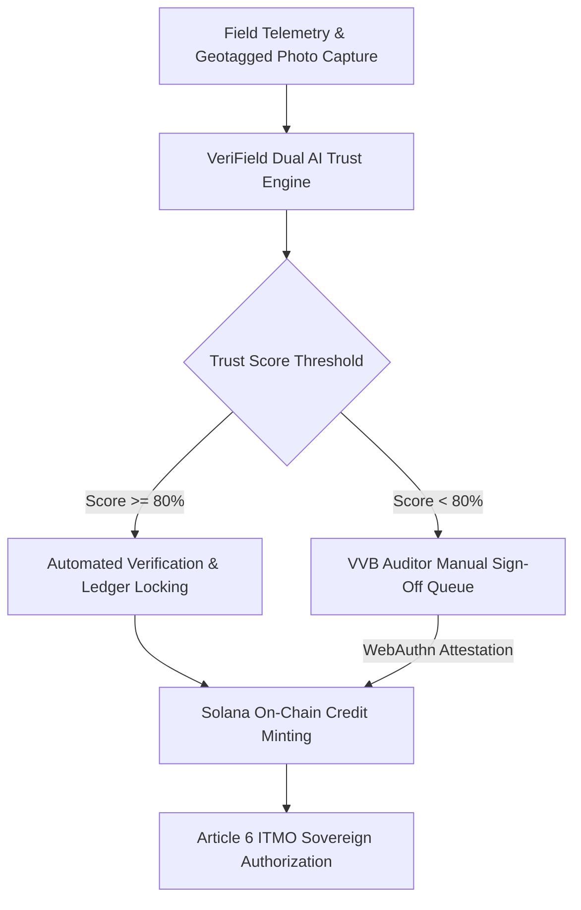

# 01. Executive Investor Deck — VeriField Nexus CIOS Level 5

## 1. Executive Summary & Core Value Proposition

VeriField Nexus represents a paradigm shift in climate infrastructure technology. Designed as an enterprise-grade Climate Infrastructure Operating System (CIOS Level 5), the platform automates the origination, verification, risk management, and registry issuance of carbon reduction and removal assets across sovereign jurisdictions.

Unlike legacy unverified voluntary offset portals, VeriField Nexus integrates physical IoT sensor telemetry, multi-modal neural computer vision (`VeriField Vision-v4.2`), and deterministic UN CDM physics calculations into a unified, cryptographically auditable operating system.

---

## 2. Global Carbon Market Landscape & Target Opportunity

The global carbon markets are transitioning rapidly under Paris Agreement Article 6 rules towards sovereign-backed Internationally Transferred Mitigation Outcomes (ITMOs) and high-durability carbon removals.

### Market Size & Growth Projections:

- **Total Addressable Market (TAM)**: $250B+ projected market volume by 2030 across sovereign ITMO transfers, compliance registries, and corporate net-zero procurement.

- **Serviceable Addressable Market (SAM)**: $45B across clean cookstoves, hybrid renewable energy mini-grids, biochar pyrolysis, and commercial EV fleets in developing economies.

- **Serviceable Obtainable Market (SOM)**: $8.5B within 36 months by onboarding national carbon authorities and Tier-1 project developers across Africa, Asia, and Latin America.

---

## 3. Technology Architecture & Competitive Moat

The platform is built on a role-first architecture where the UI, metrics, AI recommendations, and navigation sequences dynamically adapt to the authenticated user's explicit enterprise role.

### Key Moat Pillars:

1. **Dual-Engine Hybrid AI**: Merges deterministic mathematical physics (FFT Moiré spectrum analysis, sub-meter Haversine spatial validation) with multi-modal neural vision.

2. **WebAuthn Cryptographic VVB Attestation**: Mandatory biometric/hardware key sign-off for accredited auditors, producing immutable audit trails.

3. **Four Sector Core Mechanics**: Native support strictly focused on Clean Cookstoves (`AMS-II.G`), Hybrid Renewable Energy (`ACM0002`), Biochar Removal (`EBC-C`), and Electric Vehicles (`AMS-III.C`).

---

## 4. Business Model & Financial Growth Plan

- **Enterprise Core License**: $120,000 to $500,000 annual recurring revenue (ARR) per sovereign registry or corporate developer.

- **Verification Throughput Fee**: $0.15 to $0.45 per verified tCO2e processed through the Dual AI Trust Engine.

- **Protocol Issuance Royalty**: 0.5% protocol fee on minted Article 6 ITMO tokens on Solana.

---

## 5. Revision History

| Version | Date | Author | Description |

| :--- | :--- | :--- | :--- |

| v5.0 | 2026-07-24 | VeriField Executive Board | Canonical Enterprise Investor Deck |
