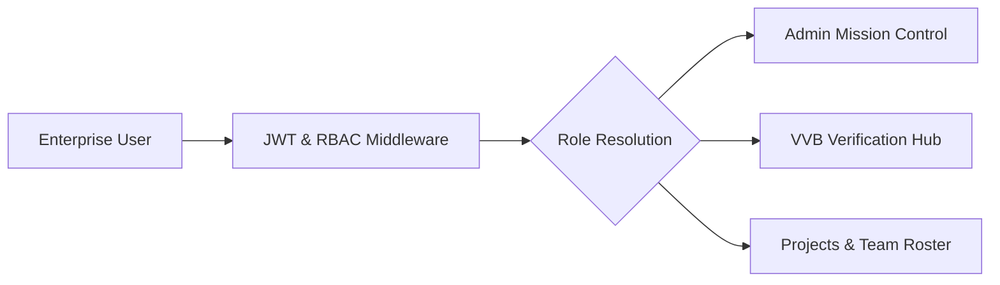

# 02. Enterprise Product Proposal — VeriField Nexus

## 1. Executive Summary

This enterprise proposal outlines the deployment model, commercial structure, and technical integration framework for VeriField Nexus across sovereign carbon authorities and multinational project developers.

## 2. Product Capabilities & Enterprise Modules

- **Dynamic Role-Based Workspaces**: 11 exclusive enterprise workspaces tailored for Administrators, Project Managers, QA Officers, VVB Auditors, Registry Managers, and Executive Sponsors.

- **Supported Sector Engines**:

  1. Clean Cookstoves (Gold Standard `AMS-II.G`)

  2. Hybrid Renewable Energy (`ACM0002` / `AMS-I.D`)

  3. Biochar Carbon Removal (`EBC-C` / Verra `VM0044`)

  4. Electric Vehicles (`AMS-III.C` / `VM0038`)

- **Real-Time Data Pipeline**: Direct integration between PostgreSQL database activity records and dynamic frontend notification centers.

## 3. System Architecture & Tenant Isolation

## 4. Implementation Timeline & Commercial Terms

- **Phase 1 (Weeks 1-2)**: Tenant provisioning, role assignment, and organization configuration.

- **Phase 2 (Weeks 3-4)**: Field agent onboardings, sensor telemetry integration, and VVB auditor training.

- **Phase 3 (Month 2+)**: Full production operation and on-chain Article 6 credit minting.

## 5. Revision History

| Version | Date | Author | Description |

| :--- | :--- | :--- | :--- |

| v5.0 | 2026-07-24 | Commercial Governance Team | Official Enterprise Proposal |
