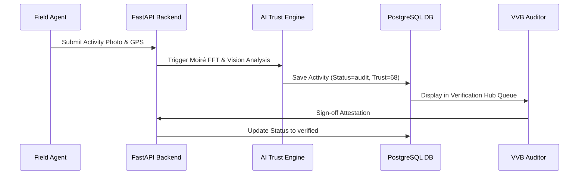

# 03. Product Requirements Document (PRD) — VeriField Nexus CIOS Level 5

## 1. Document Overview & Executive Summary

This Product Requirements Document (PRD) establishes the definitive technical and functional requirements for VeriField Nexus Level 5 Climate Infrastructure Operating System.

## 2. High-Level Requirements & System Constraints

- **REQ-1 (Role-First Dynamic UI)**: The interface MUST render role-exclusive workspaces via `RoleBasedDashboard.tsx` and dynamic navigation ordering in `DynamicSidebar.tsx`.

- **REQ-2 (Four Sectors Only)**: The platform MUST enforce strict domain boundaries covering Clean Cookstoves, Hybrid Energy, Biochar, and EV only (No ARR, No Forestry).

- **REQ-3 (Real-Time Database Ingestion)**: AI recommendations and notification drawers MUST query live PostgreSQL database records (`fetchActivities()`).

## 3. Functional Specifications by Module

### 3.1 Projects & Team Management Workspace

- Interactive 12-Role Project Team Roster cards.

- Member profile editing, password reset modal (`Key` icon API call), and system role assignment.

- Real-Time Super Admin System Activity Monitor catch-all.

### 3.2 Verification Hub & Audit Queue

- Live query of flagged activities (`status = audit` or `trust_score < 80`).

- WebAuthn cryptographic attestation sign-off buttons routing to Solana minting.

## 4. Non-Functional Requirements

- **Performance**: Next.js production build MUST compile static and dynamic routes in under 3.0 seconds with zero warnings.

- **Security**: Strict JWT bearer token authentication, CORS isolation, and Content Security Policy headers.

## 5. Revision History

| Version | Date | Author | Description |

| :--- | :--- | :--- | :--- |

| v5.0 | 2026-07-24 | Chief Product Officer | Canonical Level 5 PRD Release |
