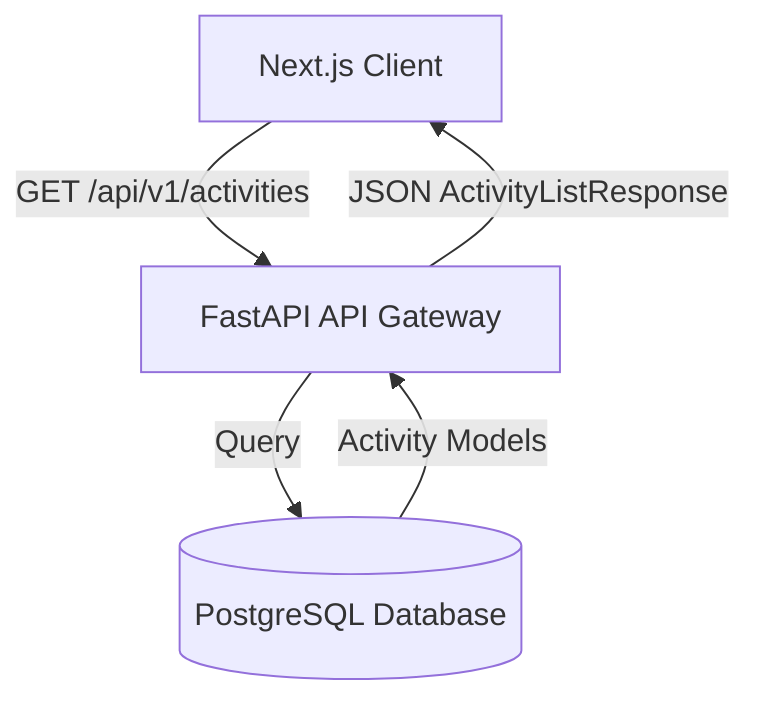

# 04. Functional Specification — VeriField Nexus

## 1. Executive Summary

Detailed technical specification defining REST API endpoints, Pydantic schemas, database models, and state management rules.

## 2. API Endpoint Architecture

- `POST /api/v1/auth/login`: Authenticate user and issue JWT access token.

- `GET /api/v1/activities`: Return paginated activity records.

- `GET /api/v1/activities/{id}`: Return single activity details.

- `GET /api/v1/activities/{id}/trust`: Return trust score breakdown (GPS, Moiré visual, frequency scores).

## 3. Data Validation & Error Handling

- All endpoints handle database timeouts and array parsing safely to prevent frontend infinite loading spinners.

## 4. Revision History

| Version | Date | Author | Description |

| :--- | :--- | :--- | :--- |

| v5.0 | 2026-07-24 | Software Architecture Team | Level 5 Functional Spec |
