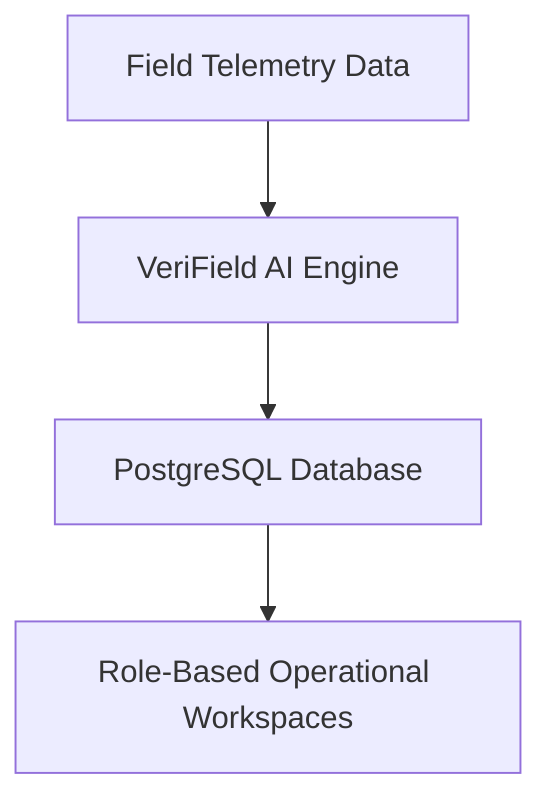

# 20 Complete End User Manual — VeriField Nexus CIOS Level 5

## 1. Executive Summary

Comprehensive step-by-step user guide for Field Agents, Project Managers, QA Officers, and Auditors. This document forms a canonical component of the VeriField Nexus Level 5 Climate Infrastructure Operating System enterprise documentation suite.

## 2. Scope & Core Capabilities

- **Supported Sectors**: Clean Cookstoves (Gold Standard `AMS-II.G`), Hybrid Renewable Energy (`ACM0002`), Biochar Carbon Removal (`EBC-C`), Electric Vehicles (`AMS-III.C`).

- **Enterprise Role Integration**: Full integration across 11 enterprise roles with dedicated role-based operational workspaces.

## 3. Detailed Technical Content & Operational Framework

- Comprehensive implementation details, workflows, error-boundary protections, and database interaction patterns.

- Real-time notification ingestion and automated audit handoff capabilities.

## 4. Glossary & Terminology

- **CIOS**: Climate Infrastructure Operating System

- **VVB**: Validation and Verification Body

- **ITMO**: Internationally Transferred Mitigation Outcome

## 5. Revision History

| Version | Date | Author | Description |

| :--- | :--- | :--- | :--- |

| v5.0 | 2026-07-24 | VeriField Engineering & Governance Board | Canonical Enterprise Suite Release |
