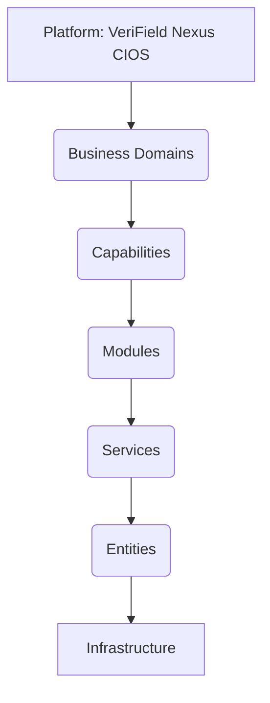

# Enterprise Reference Model

The Enterprise Reference Model is the master hierarchy of VeriField Nexus. It defines the structural decomposition of the platform from its highest conceptual layer down to the underlying infrastructure.

## Master Hierarchy

## Layer Definitions

### 1. Platform (VeriField Nexus CIOS)
The overarching ecosystem. The digital infrastructure that connects climate action on the ground with national compliance systems and global financial markets.

### 2. Business Domains
The highest-level functional areas of the platform. Bounded contexts that align with the climate infrastructure lifecycle.
- **Identity & Access Management:** Who can access the platform and what they can do.
- **Governance & Policy:** The rules, methodologies, and jurisdictional boundaries governing operations.
- **Operations & Execution:** The lifecycle of projects, assets, and activities.
- **Monitoring, Reporting & Verification (MRV):** Collection of evidence, field verification, and independent audits.
- **Registry & Ledger:** The issuance, tracking, and retirement of carbon credits.

### 3. Capabilities
Specific business functions that the platform provides within each domain. Capabilities describe *what* the business does, not *how* it does it.
- *Example (Operations Domain):* Project Lifecycle Management, Asset Management.
- *Example (Governance Domain):* Policy Enforcement, Jurisdiction Management.

### 4. Modules
The logical grouping of software components that deliver a specific capability.
- *Example:* The `Projects Module`, the `Evidence Management Module`.

### 5. Services
The runtime microservices or logical service boundaries within a module that execute specific business logic via APIs.
- *Example:* `SpatialQueryService`, `ComplianceValidationService`, `IssuanceService`.

### 6. Entities
The core data structures and objects managed by the services. Entities hold state, relationships, and lifecycle information.
- *Example:* `Project`, `Asset`, `Evidence`, `Jurisdiction`, `Audit`.

### 7. Infrastructure
The foundational technical resources required to run the services and store the entities.
- *Example:* PostgreSQL Databases, Blob Storage, Redis Cache, API Gateways, Compute Clusters.

## Architectural Traceability

This reference model ensures complete traceability. Any new piece of infrastructure must support an entity. Every entity must belong to a service. Every service must be part of a module. Every module must deliver a capability. Every capability must reside within a defined business domain of the VeriField Nexus platform.
