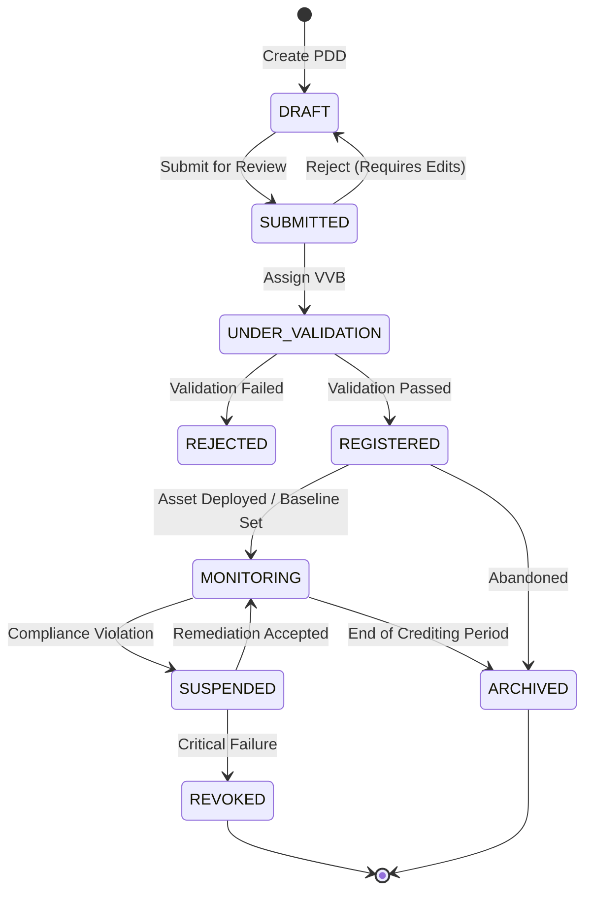
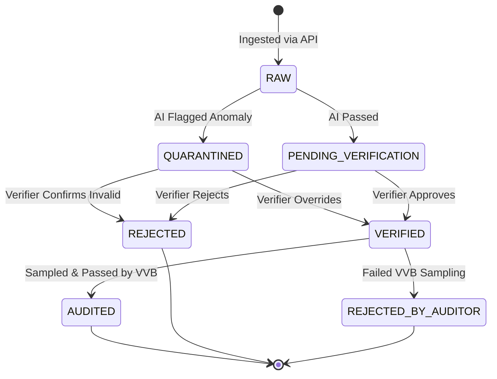
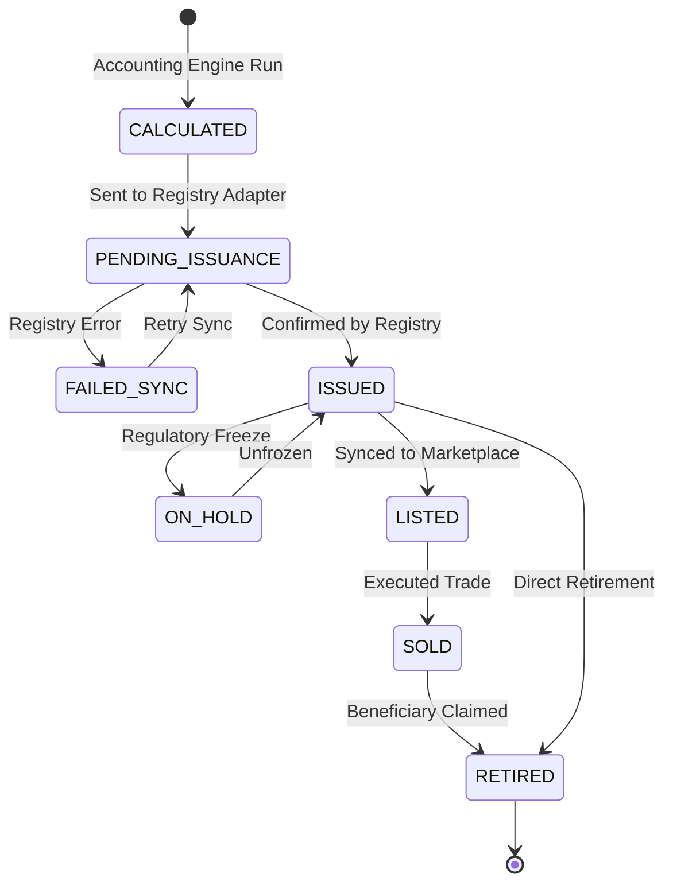

# Enterprise State Machines

Entities in the VeriField Nexus CIOS do not change state arbitrarily. They follow strict, mathematically sound state machines. State transitions are triggered by explicit actions or domain events, and each transition requires validation against the rules engine.

## 1. Project Lifecycle State Machine

The `Project` entity represents the core initiative generating climate impact.

### Transition Constraints
- `SUBMITTED -> UNDER_VALIDATION`: Requires the Project to be fully contained within a valid `Jurisdiction`.
- `UNDER_VALIDATION -> REGISTERED`: Requires a cryptographically signed Validation Statement from an authorized `Organization (VVB)`.

## 2. Evidence Lifecycle State Machine

The `Evidence` entity represents a singular proof point (e.g., an IoT reading or a field photo).

## 3. Carbon Credit Issuance State Machine

The `CarbonCredit` or `IssuanceBatch` entity.

## Soft Deletion Behavior

The state machines above do not include `DELETED`. 
- **Hard deletion (`DELETE FROM table`) is strictly prohibited** for business entities to ensure ledger immutability and auditability.
- Instead, records transition to an `ARCHIVED` state, or a generic `is_deleted = true` column is toggled. Soft-deleted records are filtered out of standard operational views but remain accessible via the Enterprise Audit API.
