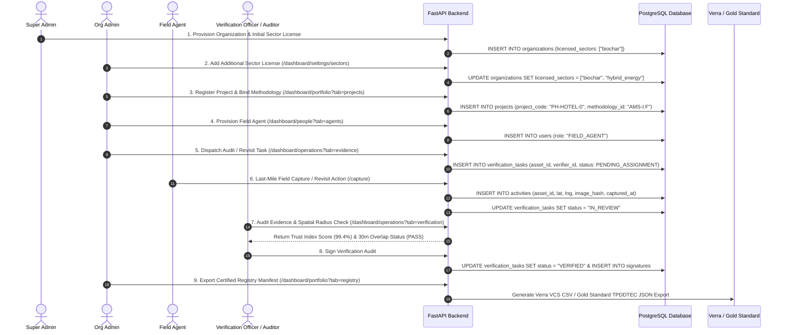

# 03 — Complete End-to-End User Journeys

## End-to-End Operational Lifecycle Sequence

```mermaid

sequenceDiagram

    autonumber

    actor SA as Super Admin

    actor OA as Org Admin

    actor FA as Field Agent

    actor VO as Verification Officer / Auditor

    participant BE as FastAPI Backend

    participant DB as PostgreSQL Database

    participant REG as Verra / Gold Standard


    SA->>BE: 1. Provision Organization & Initial Sector License

    BE->>DB: INSERT INTO organizations (licensed_sectors: ["biochar"])


    OA->>BE: 2. Add Additional Sector License (/dashboard/settings/sectors)

    BE->>DB: UPDATE organizations SET licensed_sectors = ["biochar", "hybrid_energy"]


    OA->>BE: 3. Register Project & Bind Methodology (/dashboard/portfolio?tab=projects)

    BE->>DB: INSERT INTO projects (project_code: "PH-HOTEL-0", methodology_id: "AMS-I.F")


    OA->>BE: 4. Provision Field Agent (/dashboard/people?tab=agents)

    BE->>DB: INSERT INTO users (role: "FIELD_AGENT")


    OA->>BE: 5. Dispatch Audit / Revisit Task (/dashboard/operations?tab=evidence)

    BE->>DB: INSERT INTO verification_tasks (asset_id, verifier_id, status: PENDING_ASSIGNMENT)


    FA->>BE: 6. Last-Mile Field Capture / Revisit Action (/capture)

    BE->>DB: INSERT INTO activities (asset_id, lat, lng, image_hash, captured_at)

    BE->>DB: UPDATE verification_tasks SET status = "IN_REVIEW"


    VO->>BE: 7. Audit Evidence & Spatial Radius Check (/dashboard/operations?tab=verification)

    BE-->>VO: Return Trust Index Score (99.4%) & 30m Overlap Status (PASS)


    VO->>BE: 8. Sign Verification Audit

    BE->>DB: UPDATE verification_tasks SET status = "VERIFIED" & INSERT INTO signatures


    OA->>BE: 9. Export Certified Registry Manifest (/dashboard/portfolio?tab=registry)

    BE->>REG: Generate Verra VCS CSV / Gold Standard TPDDTEC JSON Export

```
