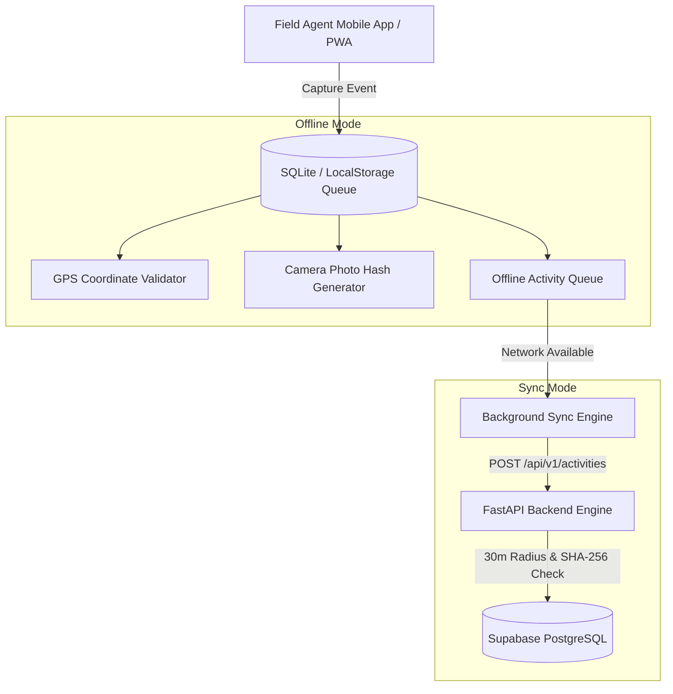

# 07 — Flutter Mobile Architecture & Offline Synchronisation

## Mobile Application Architecture & Field Agent Pipeline

The mobile application (`/mobile` Flutter codebase & PWA `/capture`) enables field agents to operate reliably in low-connectivity rural environments.

---

## Core Mobile Capabilities

1. **Offline Activity Logging**:

   - Captures field submissions locally when network connectivity is lost.

2. **Hardware Telemetry Integration**:

   - Reads IoT sensors, stove IDs, and Bluetooth/NFC telemetry tags.

3. **Cryptographic SHA-256 Hashing**:

   - Generates an immutable SHA-256 hash of photos at capture time to prevent tampering or duplicate uploads.

4. **GPS Boundary Lock**:

   - Records high-accuracy latitude and longitude coordinates for automated 30m spatial radius check.

5. **Background Conflict Resolution**:

   - Automatically syncs pending field logs upon network re-establishment without blocking agent workflow.
