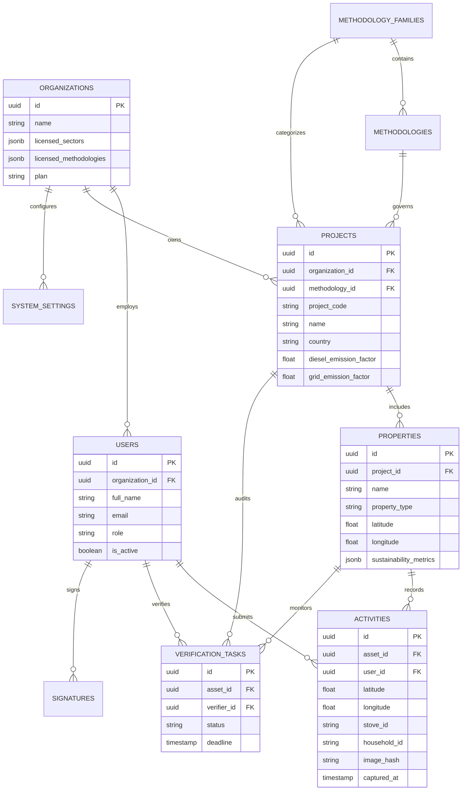

# 09 — Database ERD & Entity Relationships

## PostgreSQL Entity-Relationship Diagram

---

## Database Partitioning Scheme

- Table `activities` is partitioned monthly (`activities_y2026m07`, etc.) based on `captured_at` for high-throughput IoT scale.
