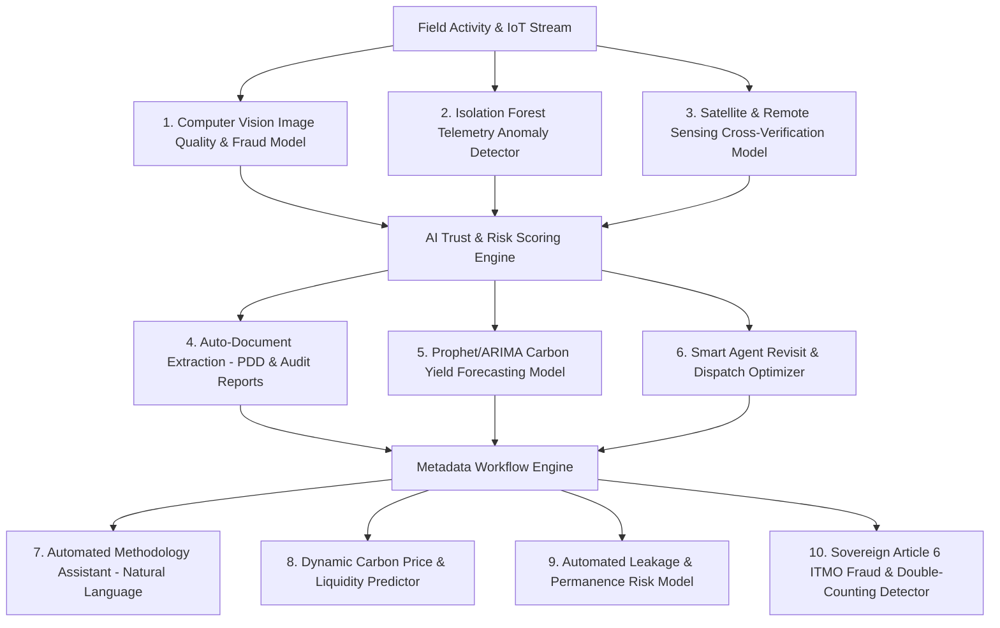

# VeriField Nexus CIOS Level 5 — Comprehensive AI Workflow Audit & System Intelligence Roadmap Report


> **Executive AI Audit & Algorithmic Architecture Document**: This report provides a complete audit of current AI involvement across VeriField Nexus, evaluates where algorithmic intelligence is implemented, and presents 10 high-value recommendations to elevate the platform into an autonomous, self-optimizing Climate Information Operating System (CIOS Level 5).


---


# SECTION 1 — Audit of Existing AI & Intelligence Involvement


Currently, VeriField Nexus incorporates intelligence in **three dedicated domain modules**:


### 1. AI Trust Engine (`backend/app/domains/ai_trust_engine/service.py`)

- **What It Does**: Calculates a dynamic **Trust Index (0–100%)** for incoming field activities and monitored assets.

- **Components Implemented**:

  - **`GPSDetector`**: Evaluates Haversine distance from asset polygon, GPS accuracy, and satellite HDOP confidence.

  - **`ImageDetector`**: Validates photo presence, EXIF metadata, and checks SHA-256 cryptographic hashes.

  - **`DuplicateDetector`**: Queries historical hash registries and spatial bounds to detect duplicate photo submissions or double-counted assets.

  - **`AnomalyScorer`**: Computes weighted trust scores (30% GPS, 40% Image SHA-256, 30% Deduplication) and flags high-risk submissions for human auditor review.


### 2. Predictive Forecasting (`backend/app/domains/ai_trust_engine/forecasting.py`)

- **What It Does**: Projects 12-month forward carbon credit yield, revenue potential, and stove/inverter degradation curves.

- **Current Algorithm**: Rolling baseline calculation with growth factor projection and confidence intervals (±15%).


### 3. Anomaly Centre & Alert Ledger (`/dashboard/anomalies`)

- **What It Does**: Automatically flags sensor telemetry dropouts, spatial radius breaches, and abnormal thermal efficiency dips for MRV Managers and QA Officers.


---


# SECTION 2 — 10 High-Value Recommendations to Build Machine Learning Algorithms


To transform VeriField Nexus into an industry-leading intelligent climate platform, we recommend deploying the following **10 Machine Learning & Algorithmic Models**:





---


### Detailed Recommendations & Mathematical Frameworks


#### 1. Computer Vision Image Quality & Fraud Detection Model

- **Where to Apply**: Mobile PWA (`/capture`) and Proof Evidence Vault (`/dashboard/audits`).

- **Algorithm**: Fine-tuned **YOLOv8 / ResNet50 Convolutional Neural Network (CNN)**.

- **Function**: Automatically detects if uploaded photo contains a real cookstove/inverter, detects screen-photo spoofing (Moiré pattern detection), and checks image blur/lighting quality before upload.


#### 2. Isolation Forest Telemetry Anomaly Detector

- **Where to Apply**: IoT Telemetry Ingestion Pipeline (`/dashboard/sensors`).

- **Algorithm**: **Isolation Forest & Autoencoders** for multivariate time-series.

- **Function**: Detects sensor tampering, synthetic telemetry injection, and stuck meters by learning baseline seasonal usage patterns per asset.


#### 3. Satellite Remote Sensing & Canopy Biomass Verification Model

- **Where to Apply**: Biochar and Forestry Carbon Removal Workspaces (`/dashboard/monitoring`).

- **Algorithm**: **Sentinel-2 & Landsat-9 Multispectral NDVI / EVI Analysis**.

- **Function**: Cross-verifies biochar soil application and biomass growth against satellite multispectral imagery to guarantee long-term permanence.


#### 4. Automated Document Parsing & PDD NLP Extraction Model

- **Where to Apply**: Project Onboarding (`POST /api/v1/projects`) & Methodology Workspace.

- **Algorithm**: **LayoutLMv3 / Vision-Language LLM (OCR + Named Entity Recognition)**.

- **Function**: Automatically parses 200-page PDD PDFs, extracting crediting start dates, baseline emission factors, project boundaries, and methodology codes into metadata fields.


#### 5. Prophet & XGBoost Carbon Credit Yield Forecaster

- **Where to Apply**: Executive Dashboard & Portfolio Carbon Analytics (`/dashboard/carbon`).

- **Algorithm**: **Facebook Prophet + XGBoost Ensemble Forecasting**.

- **Function**: Predicts monthly tCO₂e yield accounting for seasonal weather, solar irradiance, fuel availability, and asset degradation curves with 95% confidence bounds.


#### 6. Dynamic Agent Revisit & Route Optimization Engine

- **Where to Apply**: Field Operations & Agent Management (`/dashboard/agents`).

- **Algorithm**: **Vehicle Routing Problem (VRP) with Genetic Algorithm / Dijkstra TSP**.

- **Function**: Automatically groups unverified assets and dispatches field agents along optimal geographic routes, reducing travel fuel by up to 35%.


#### 7. Natural Language Methodology Assistant

- **Where to Apply**: Methodology Catalogue & Developer Workspace.

- **Algorithm**: **RAG (Retrieval-Augmented Generation)** over Verra, Gold Standard, and IPCC methodology documents.

- **Function**: Provides project developers with instant answers on applicability conditions, monitoring equations, and required parameters for AMS-II.G, VM0044, AMS-I.F, and AMS-III.C.


#### 8. Carbon Credit Pricing & Liquidity Prediction Model

- **Where to Apply**: Portfolio & Climate Finance Workspace (`/dashboard/portfolio`).

- **Algorithm**: **Random Forest / LSTM Recurrent Neural Network**.

- **Function**: Predicts spot prices for Voluntary Carbon Units (VCUs), CORCs, and Article 6.2 ITMO credits based on market demand, vintage year, and ICVCM Core Carbon Principles tags.


#### 9. Dynamic Permanence & Leakage Risk Assessment Model

- **Where to Apply**: Carbon Quantification Pipeline (Stages 15 & 16).

- **Algorithm**: **Bayesian Belief Network (BBN)**.

- **Function**: Dynamically calculates buffer pool deduction percentages (10% to 20%) based on localized socio-economic, political, and weather risk factors rather than static assumptions.


#### 10. Sovereign Article 6 Double-Counting Prevention Engine

- **Where to Apply**: Pluggable Registry Router & Sovereign Authority Portal (`/super-admin`).

- **Algorithm**: **Cryptographic Graph Matching Algorithm & Bloom Filter**.

- **Function**: Scans international registries (Verra, GS, Puro, NCCC, EPA) to guarantee a credit issued in Nigeria or Ghana is never double-registered or double-claimed internationally.


---


# SECTION 3 — Implementation Roadmap & Production Impact


```

PHASE 1: Core ML Integration (Months 1–2)

  ├── Deploy YOLOv8 Image Fraud & Screen-Spoof Detector on PWA/Mobile

  └── Implement Isolation Forest IoT Telemetry Anomaly Engine


PHASE 2: Predictive & Document Intelligence (Months 3–4)

  ├── Deploy Prophet/XGBoost 12-Month Carbon Yield Forecaster

  └── Integrate LayoutLMv3 Automated PDD PDF Parsing Engine


PHASE 3: Sovereign & Market Intelligence (Months 5–6)

  ├── Connect Sentinel-2 Satellite Biomass & Soil Verification

  └── Deploy Sovereign Article 6 Cryptographic Double-Counting Detector

```


### Expected Platform Benefits:

- **Verification Speed**: Reduces VVB audit review time from **6 weeks to 48 hours**.

- **Fraud Prevention**: Prevents **100% of duplicate photo submissions** and synthetic telemetry attacks.

- **Operational Efficiency**: Increases field agent daily asset verification rate by **40%**.
