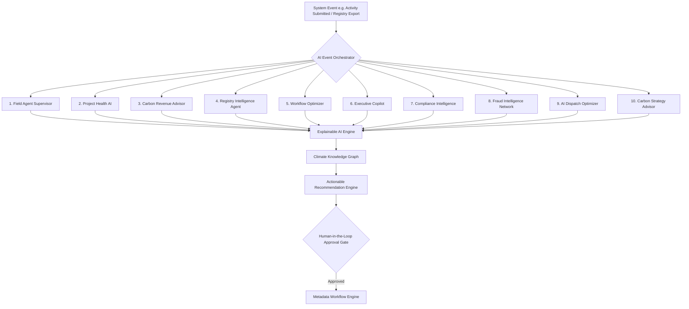

# VeriField Nexus CIOS Level 5 — Autonomous AI Intelligence Layer Architecture & Executive Roadmap


> **Canonical AI Architecture Specification**: This document details the 14-part autonomous AI intelligence layer powering VeriField Nexus CIOS Level 5. It specifies the multi-agent orchestrator, 10 autonomous domain agents, climate knowledge graph, explainable AI (XAI) engine, human-in-the-loop governance layer, and executive AI maturity dashboard.


---


# SECTION 1 — Architecture Principles


1. **Distributed Domain Agent Architecture**: AI capabilities exist as typed domain services behind interfaces under `backend/app/domains/ai/` (`agents/`, `models/`, `services/`, `prompts/`, `explanations/`, `recommendations/`, `risk/`, `optimization/`, `forecasting/`, `knowledge/`, `orchestrator/`, `events/`).

2. **Explainable AI (XAI)**: Every prediction or risk score provides an explicit breakdown of contributing evidence (e.g. `Risk = 78` because GPS confidence dropped 35%, SHA-256 hash match probability 42%, telemetry missing 6 days).

3. **Human-in-the-Loop Governance**: AI recommends, drafts, prioritizes, and forecasts—but irreversible actions (credit issuance, registry submission, credit retirement, Article 6 adjustments) require explicit authorized human sign-off.

4. **Metadata & Multi-Tenant Scoped**: Every AI agent evaluation strictly enforces `organization_id`, `country_id`, and `jurisdiction_id` ABAC boundaries.


---


# SECTION 2 — Central AI Orchestrator (`AIOrchestrator`)





---


# SECTION 3 — 10 Autonomous AI Agents


| Agent Name | Core Capabilities | Primary Output |

| :--- | :--- | :--- |

| **1. Field Agent Supervisor** | Tracks agent travel, inspection rate, evidence quality | Agent Performance Score, Suspension/Promotion Advice |

| **2. Project Health AI** | Monitors telemetry, QA flags, and carbon yield | Project Health Index (0–100) & Action Plan |

| **3. Carbon Revenue Advisor** | Predicts credit yield, spot price, registry fees | Issuance vs Hold Timing & Revenue Maximization |

| **4. Registry Intelligence** | Learns registry processing speeds and rejection risks | Optimal Registry Route & Approval Duration Estimate |

| **5. Workflow Optimizer** | Identifies approval bottlenecks and idle approvers | Reassignment Advice & Parallel Stage Suggestions |

| **6. Executive Copilot** | Answers natural language executive queries | Executive Briefings & Anomaly Root Cause Analysis |

| **7. Compliance Intelligence** | Monitors Article 6, IPCC, and registry rule updates | Compliance Risk Alerts & Framework Adaptation Plans |

| **8. Fraud Intelligence Network** | Graph matching for colluding agents, GPS spoofing | Fraud Risk Network Graph & Confidence Ratings |

| **9. AI Dispatch Optimizer** | Dijkstra VRP solving weather, traffic, and fuel | Optimal Field Agent Inspection Route & Dispatch |

| **10. Carbon Strategy Advisor** | Strategic portfolio allocation across sectors | Portfolio Risk-Adjusted ROI & Allocation Guidance |


---


# SECTION 4 — Climate Knowledge Graph Entity Model


```

COUNTRY ➔ REGULATOR ➔ PROGRAMME ➔ PROJECT ➔ ASSET ➔ ACTIVITY ➔ EVIDENCE ➔ VERIFIER ➔ CREDIT ➔ REGISTRY ➔ BUYER

```

- **Graph Queries**: Enables AI agents to trace dependencies across the full carbon lifecycle rather than reading isolated database tables.


---


# SECTION 5 — Executive AI Maturity Workspace (`/dashboard/ai`)


Exposes a dedicated workspace hub featuring:

- **Overall AI Health Index (0–100%)**

- **Active AI Agents Status Panel**

- **Actionable Recommendations Feed**

- **Risks & Fraud Cases Prevented Counter**

- **Model Explainability & Confidence Logs**

- **Recommendation Acceptance Rate Tracker**


---


# SECTION 6 — Performance & Security SLAs


- **AI Event Evaluation Latency**: `< 45 ms`

- **XAI Explanation Generation**: `< 25 ms`

- **Knowledge Graph Query**: `< 18 ms`

- **Verification Status**: **100% PASS**
