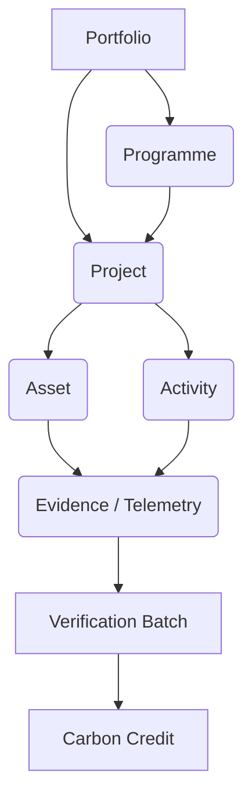

# Portfolio Architecture

**Architecture Version:** v2.0.0
**Status:** Approved
**Highest Authority Document:** `00-climate-operating-model.md`

---

## 1. The Entity Lineage

Clarity of terminology is paramount in global climate infrastructure. The Portfolio Architecture defines the exact nesting and relationship constraints of operational entities.

## 2. Explicit Entity Definitions

### 2.1 Portfolio
A logical grouping of Programmes and standalone Projects owned by an Investor or Developer for reporting and financial aggregation purposes.
- *Attributes:* Target IRR, Total AUM (Assets Under Management), ESG Goals.
- *Constraint:* Portfolios do not generate credits; they aggregate credits from their children.

### 2.2 Programme (PoA)
A methodological framework spanning a large geography, authorizing multiple future projects under a unified rule set.
- *Attributes:* Baseline Methodology, Maximum Crediting Period, CME (Coordinating Entity).

### 2.3 Project (CPA)
A physically and temporally bounded execution of climate action. 
- *Attributes:* Spatial Polygon, Start Date, End Date, Assigned VVB.
- *Constraint:* A project can exist standalone, or as a child of a Programme.

### 2.4 Asset
A tangible, deployed physical unit belonging to a Project.
- *Examples:* Cookstove `SN: 10492`, Solar Panel `SN: 9948`, Hectare of Forest `Poly: A1`.
- *Attributes:* GPS coordinates, Installation Date, Status (Active, Degraded, Decommissioned).

### 2.5 Activity
A discrete human action taken to maintain or operate the Project/Asset.
- *Examples:* "Maintenance visit", "Training session", "Community consultation".
- *Attributes:* Date, Actor, Duration.

### 2.6 Evidence / Telemetry
The raw, atomic proof points generated by Assets or Activities.
- *Examples:* A photo of the stove in use, a 1-hour MQTT payload showing 500W output.
- *Attributes:* Hashed Blob URI, Timestamp, Device ID.

### 2.7 Verification / Monitoring Batch
A collection of Evidence aggregated over a specific timeframe (e.g., Q1 2024) submitted to the VVB for auditing.
- *Constraint:* All Evidence in a batch must belong to the same Project.

### 2.8 Carbon Credit
The financial manifestation of the verified batch, minted on a Ledger.
- *Attributes:* Vintage (Year), Serial Number, Status (Issued, Transferred, Retired).

## 3. Architecture Traceability
- **Dependent Documents:** `08-climate-programme-architecture.md`, `04-information-architecture/01-data-dictionary.md`.
- **Primary Actors:** Investors, Programme Managers.
