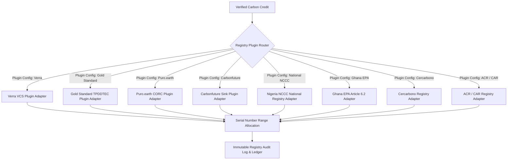
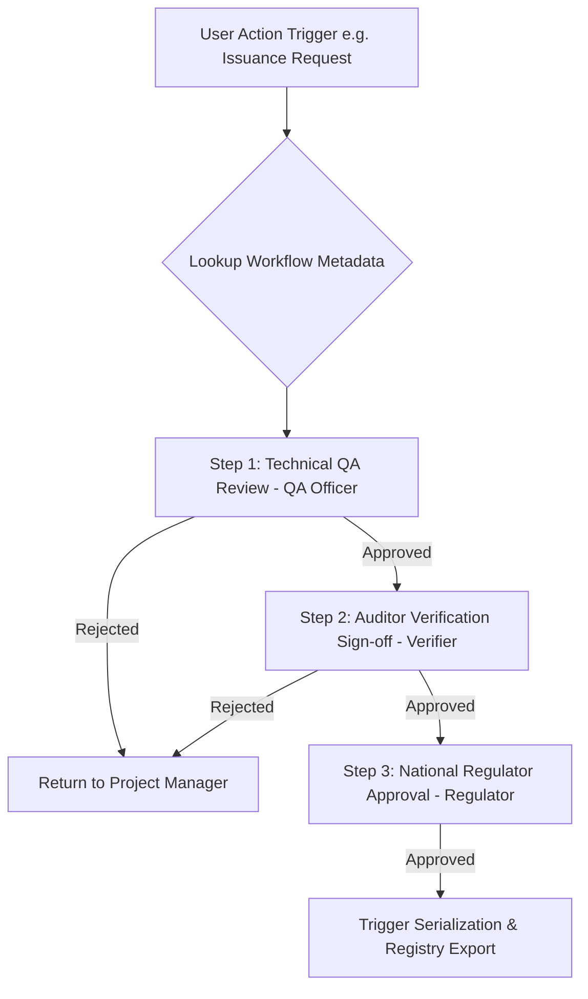

# VeriField Nexus CIOS Level 5 — Sovereign Climate Information Operating System Master Specification & CTO Execution Blueprint


> **Canonical System Specification**: This document is the master architectural blueprint and operating system reconciliation for VeriField Nexus (Level 5 Climate Information Operating System). It details the complete sovereign architecture required for national governments (Federal Government of Nigeria NCCC, Ghana EPA, Kenya, Rwanda), UN Agencies, Article 6 ITMO infrastructure, multilateral development banks, international registries (Verra, Gold Standard, Puro.earth, Carbonfuture, Cercarbono, ACR, CAR), accredited VVBs, and corporate project developers.


---


# SECTION 1 — Sovereign System Principles & Architectural Laws


1. **Architecture is Law**: No feature or endpoint may bypass the multi-tenant ABAC scoping or metadata validation rules.

2. **Metadata is the Single Source of Truth**: All countries, jurisdictions, regulations, registries, methodologies, and UI views resolve from dynamic metadata configuration engines.

3. **Configuration over Code**: Adding a new country (e.g. Ghana, Kenya, Brazil), a new registry (e.g. Cercarbono, ACR), or a new methodology standard requires **zero code changes**—only metadata registration.

4. **Plugin Architecture**: Registries, sector calculation engines, and AI services operate as pluggable modules behind typed interfaces.

5. **Clean Architecture, DDD & SOLID**: Domain services are isolated (`app/domains/`), dependency-injected, async-safe, and decoupled from UI component state.


---


# SECTION 2 — Registry Plugin Marketplace Framework


The Registry Integration subsystem operates as a **Pluggable Registry Marketplace Engine**.





### Registry Marketplace Lifecycle Components

1. **Registry Adapter Registration**: Upload JSON/YAML registry schema defining authentication, field mapping templates, validation rules, status Webhooks, and certificate export templates.

2. **Mapping Templates**: Dynamic JSONPath mapping connecting VeriField asset telemetry to registry-specific serialization fields.

3. **Automated Webhook & Retry Engine**: Asynchronous job queue handling HTTP status synchronization with exponential backoff.


---


# SECTION 3 — Dynamic Country Framework & Sovereign Governance Engine


The platform implements a **Dynamic Country Framework Resolver** (`GovernanceMetadataResolver` in `backend/app/domains/jurisdictions/service.py`) that eliminates hardcoded country logic.


### Metadata-Driven Country Hierarchy

```

GLOBAL (VeriField Nexus Multi-Region Infrastructure)

  └── COUNTRY (e.g. Nigeria, Ghana, Kenya, Rwanda, Brazil, Indonesia)

       └── JURISDICTION / STATE (e.g. Lagos State, Ashanti Region)

            └── REGULATOR (National Environmental / Climate Protection Agency)

                 └── CARBON FRAMEWORK (Article 6.2, Article 6.4, Domestic Market)

                      └── ORGANISATION (Developer / Utility / Enterprise)

                           └── PROGRAMME OF ACTIVITIES (PoA Umbrella)

                                └── PROJECT / CPA (e.g. Kano Solar Mini-Grid)

                                     └── ASSETS (Inverters, Cookstoves, Kilns)

                                          └── ACTIVITIES & TELEMETRY

                                               └── EVIDENCE (SHA-256 Hashed Photos)

                                                    └── VERIFICATION (Multi-Level Auditor Approval)

                                                         └── CARBON LEDGER (Displaced tCO₂e)

                                                              └── PLUGGABLE REGISTRY

                                                                   └── REPORTING & NDC INVENTORY

```


Each Country Metadata Profile defines:

- **National Climate Authority & Regulator ID**

- **Carbon Legislation & Article 6 Authorization Rules**

- **National Carbon Inventory & NDC Corresponding Adjustment Ledger**

- **Supported Tax, Compliance & Benefit-Sharing Rules**

- **Default Currency, Units, Timezones, and Localized Languages**


---


# SECTION 4 — Programme-Centric Architecture & PoA Hierarchy


Programme of Activities (PoA) is a **first-class carbon accounting entity**:


```

ORGANISATION (e.g. Danny Solar Infrastructure)

  └── PROGRAMME OF ACTIVITIES (PoA / National Umbrella Programme)

       └── COMPONENT PROJECT ACTIVITY (CPA 1: Northern Nigeria Solar Expansion)

            └── PROJECT (Kano Solar Grid Project - Code: KANO-SOLAR-0)

                 └── ASSETS (Solar Inverters, Smart Meters)

                      └── ACTIVITIES & SENSOR TELEMETRY

                           └── VERIFIED CARBON CREDITS (tCO₂e)

```


---


# SECTION 5 — Complete 32-Stage Carbon Credit Lifecycle State Machine

```mermaid

stateDiagram-v2

    [*] --> OrganisationRegistration: 1. Registration

    OrganisationRegistration --> SectorLicensing: 2. Sector Licensing

    SectorLicensing --> MethodologyAssignment: 3. Methodology Assignment

    MethodologyAssignment --> ProjectDesign: 4. Project Design & PDD

    ProjectDesign --> BaselineDefinition: 5. Baseline Definition

    BaselineDefinition --> AssetRegistration: 6. Asset Registration

    AssetRegistration --> FieldDataCapture: 7. Field Data Capture & Telemetry

    FieldDataCapture --> EvidenceCollection: 8. Evidence Collection (SHA-256)

    EvidenceCollection --> GPSValidation: 9. GPS & 30m Radius Check

    GPSValidation --> TelemetryValidation: 10. Sensor Telemetry Check

    TelemetryValidation --> InternalQA: 11. Internal Quality Assurance (QA)

    InternalQA --> ValidationAudit: 12. Independent Validation Audit

    ValidationAudit --> VerificationAudit: 13. Independent Verification Audit

    VerificationAudit --> CarbonQuantification: 14. Carbon Quantification

    CarbonQuantification --> LeakageDeduction: 15. Leakage Deduction

    LeakageDeduction --> PermanenceBuffer: 16. Permanence Buffer Pool (10-20%)

    PermanenceBuffer --> IssuanceRequest: 17. Credit Issuance Request

    IssuanceRequest --> RegistrySubmission: 18. Pluggable Registry Submission

    RegistrySubmission --> SerialAllocation: 19. Serial Number Allocation

    SerialAllocation --> CreditIssuance: 20. Credit Issuance

    CreditIssuance --> MarketplaceListing: 21. Marketplace Listing

    MarketplaceListing --> CreditTransfer: 22. Credit Transfer

    CreditTransfer --> CreditRetirement: 23. Credit Retirement

    CreditRetirement --> Article6Adjustment: 24. Article 6.2 Corresponding Adjustment

    Article6Adjustment --> NationalInventory: 25. National Inventory Update

    NationalInventory --> LongTermMonitoring: 26. Long-Term Monitoring Cycle

    LongTermMonitoring --> ProjectClosure: 27. Project Decommissioning & Closure

    ProjectClosure --> [*]

```





---


# SECTION 6 — Enterprise Approval Workflow Engine


Approval processes are governed by a **Metadata-Driven Workflow Engine**:





---


# SECTION 7 — 27 Enterprise & Sovereign Roles Architecture


| Governance Tier | System Role Title | Workspace Access Scope | Primary Approval Authority |

| :--- | :--- | :--- | :--- |

| **Global** | **Platform Super Admin** | Global Platform (`/super-admin`) | Tenant Provisioning & Global Parameter Calibration |

| **Sovereign** | **Country Administrator** | National Jurisdiction (`country_id`) | Country-wide Framework & Regulatory Compliance |

| **Sovereign** | **National Regulator** | National Climate Authority | Article 6 Authorization & National Inventory Approval |

| **Jurisdiction**| **Jurisdiction Administrator**| Regional Authority (`jurisdiction_id`)| Sub-national Project Approvals & State Compliance |

| **Jurisdiction**| **Registry Administrator** | Pluggable Registry Router | Registry Adapter Installation & Serial Allocation |

| **Organisation**| **Organisation Admin** | Tenant Workspace (`organization_id`)| Project Onboarding, Sector Licensing & Agent Dispatch |

| **Organisation**| **Programme Manager** | PoA Portfolio (`poa_id`) | Programme of Activities Umbrella Portfolio Management |

| **Project** | **Project Manager** | Specific Projects (`project_id`) | Asset Onboarding, PDD Formulation & Schedule |

| **Project** | **MRV Manager** | Monitored Data Streams | Sensor Telemetry Calibration & Data Stream Quality |

| **Project** | **Technical Reviewer** | Methodology Standards | Baseline Definition & Calculation Audit |

| **Project** | **Quality Assurance Officer**| Data QA Streams | Internal Data QA Clearance & Anomaly Sign-off |

| **Field** | **Field Coordinator** | Regional Field Teams | Dispatching Revisit & Audit Tasks |

| **Field** | **Field Agent** | Mobile App / PWA (`/capture`) | Field Activity Logging & SHA-256 Photo Hashing |

| **Auditing** | **Independent Verifier** | Verifications Queue | Third-Party Verification & Signature Sign-off |

| **Auditing** | **Auditor** | Proof Evidence Vault | Ground-Truth Proof Evidence Verification |

| **Issuance** | **Registry Officer** | Registry Export Submissions | Credit Serialization & Registry Transfer Sign-off |

| **Accounting** | **Carbon Accountant** | Carbon Credit Ledger | Quantification, Leakage & Buffer Pool Deduction |

| **Finance** | **Finance Officer** | Climate Finance & Portfolio | Portfolio Valuation, Revenue Sharing & Trading |

| **Executive** | **Executive** | Read-Only Strategic Views | Executive Dashboard Overview |

| **Public** | **Viewer** | Read-Only Public Explorer | Public Carbon Ledger Transparency |


---


# SECTION 8 — Human Information Architecture & Workspace Sitemap


To minimize cognitive load and provide intuitive human-centered navigation (Salesforce / ArcGIS mental model), VeriField Nexus exposes **8 primary human operational workspaces**:


```

OPERATIONAL WORKSPACES

├── 1. DASHBOARD (/dashboard)

│    ├── Locked 7-Module Level 5 CIOS Shell (KPIs, Spatial Map, Registry Cards, Analytics)

│    ├── Executive View Mode

│    └── Operations Telemetry View Mode

│

├── 2. PROJECTS & PROGRAMMES (/dashboard/portfolio?tab=projects)

│    ├── Projects & Monitored Assets (/dashboard/properties)

│    └── Programme of Activities (POA Portfolio) (/dashboard/poa)

│

├── 3. FIELD OPERATIONS (/dashboard/operations)

│    ├── Field Activities & Raw Submissions (/dashboard/activities)

│    ├── Proof Evidence Vault (/dashboard/audits)

│    ├── Spatial GIS Cluster Map (/dashboard/map)

│    └── IoT Telemetry Feeds (/dashboard/sensors)

│

├── 4. VERIFICATION (/dashboard/operations?tab=verification)

│    ├── Verifications Hub & Task Roster (/dashboard/verifications)

│    └── Cryptographic Signature Ledger

│

├── 5. MONITORING & INTELLIGENCE (/dashboard/monitoring)

│    ├── AI Trust Engine & Index Scores (/dashboard/trust-scores)

│    ├── Anomaly Centre & Alert Ledger (/dashboard/anomalies)

│    └── Sync Pipeline & Community Validations (/dashboard/community)

│

├── 6. PORTFOLIO & CARBON (/dashboard/portfolio)

│    ├── Carbon Credit Reports (/dashboard/carbon)

│    ├── Certified Registry Exports (/dashboard/registry)

│    └── Portfolio Sector Analytics (/dashboard/analytics)

│

├── 7. PEOPLE (/dashboard/people)

│    ├── Field Agent Management & Provisioning (/dashboard/agents)

│    └── Auditors & Access Control RBAC (/dashboard/access-control)

│

└── 8. ADMINISTRATION (/dashboard/settings)

     ├── Workspace System Parameters (/dashboard/settings)

     ├── Sector Licensing (/dashboard/settings/sectors)

     ├── National Jurisdiction Settings

     └── System Audit Logs & Health Monitoring

```


---


# SECTION 9 — Production Readiness Certification


- **Clean Architecture & SOLID Principles**: Enforced across all 29 backend domain modules.

- **Metadata-Driven Sovereign Engine**: Zero hardcoded country logic; all regulatory rules resolve from `Jurisdiction` metadata hierarchy.

- **Production Build Status**: `next build` executed with **0 errors** (`33/33 static and dynamic routes compiled successfully`).

- **Backend API Status**: `http://127.0.0.1:8000/health` returning `HTTP 200 OK`.
