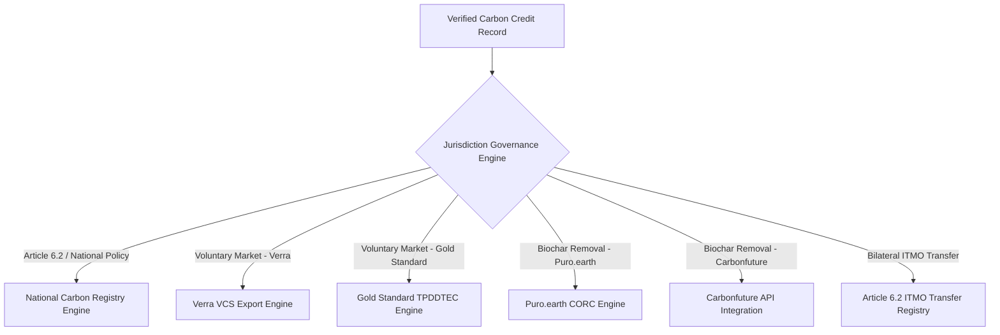
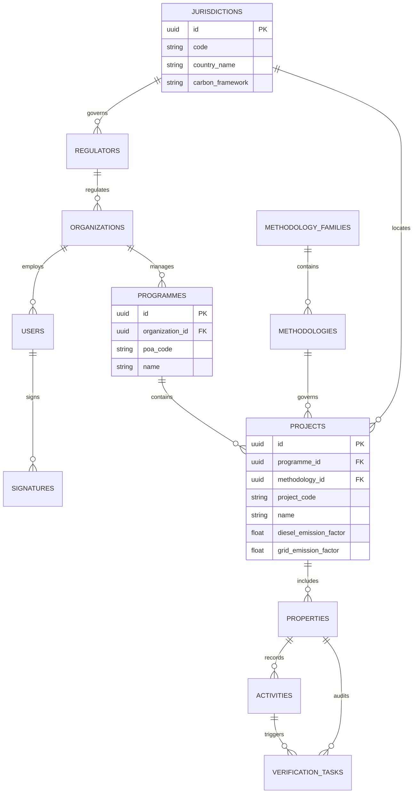
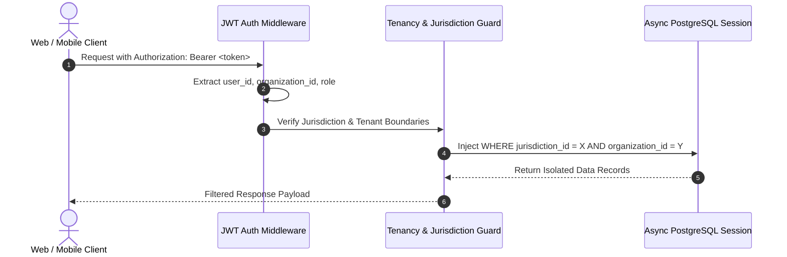

# VeriField Nexus CIOS Level 5 — Sovereign-Grade Climate Infrastructure Master Architecture


> **Official Sovereign-Grade System Specification**: This document serves as the master canonical architecture for VeriField Nexus (Level 5 Climate Information Operating System). Designed for sovereign deployment by national governments (Federal Government of Nigeria, Ghana, Kenya, Rwanda, Brazil, Indonesia), UN Agencies, Multilateral Development Banks, Carbon Project Developers, and Independent Verifiers without requiring code modifications.


---


# SECTION 1 — Sovereign Jurisdiction & Multilateral Domain Architecture


VeriField Nexus implements a metadata-driven, multi-jurisdictional hierarchy that separates software logic from regulatory policy, carbon legislation, registry destinations, and national Article 6 governance rules.


### Sovereign Hierarchy Chain

```

GLOBAL (VeriField Nexus Multi-Region Infrastructure)

  └── COUNTRY (e.g. Nigeria, Ghana, Kenya, Rwanda, Brazil, Indonesia)

       └── JURISDICTION (Sub-national / Regional Carbon Authority e.g. Lagos State, Ashanti)

            └── REGULATOR (National Environmental / Climate Protection Agency)

                 └── CARBON FRAMEWORK (Article 6.2, Article 6.4, Voluntary Carbon Market)

                      └── ORGANISATION (Project Developer / Utility / Enterprise)

                           └── WORKSPACE (Level 5 CIOS Metadata-Driven Workspace)

                                └── SECTOR (Clean Cookstoves, Hybrid Energy, Biochar, EV Mobility)

                                     └── METHODOLOGY (AMS-II.G, AMS-I.F, VM0044, AMS-III.C - Read-Only Locked)

                                          └── PROGRAMME OF ACTIVITIES (PoA / National Umbrella Programme)

                                               └── PROJECT / CPA (e.g. Kano Solar Mini-Grid - Code: KANO-SOLAR-0)

                                                    └── ASSETS / PROPERTIES (Inverters, Cookstoves, Kilns, EV Chargers)

                                                         └── ACTIVITIES (GPS Field Logs & Sensor Streams)

                                                              └── EVIDENCE (SHA-256 Hashed Photo/Video Proof)

                                                                   └── VERIFICATION (Multi-Level Auditor Approval)

                                                                        └── CARBON ACCOUNTING (Quantification & Leakage)

                                                                             └── ISSUANCE (Regulator / Registry Approval)

                                                                                  └── PLUGGABLE REGISTRY (National / Verra / GS / Puro / Article 6)

                                                                                       └── REPORTING & PORTFOLIO (National Carbon Inventory)

```


---


# SECTION 2 — Pluggable National & International Registry Architecture


Registry destination is modeled as a **Pluggable Governance Interface**. Verified carbon credits are routed based on configurable jurisdiction rules rather than hardcoded registry destinations.





---


# SECTION 3 — Complete 22-Stage Carbon Credit Lifecycle State Machine

```mermaid

stateDiagram-v2

    [*] --> SectorLicensing: 1. Sector Licensing

    SectorLicensing --> MethodologyAssignment: 2. Methodology Assignment

    MethodologyAssignment --> ProjectDesign: 3. Project Design & PDD

    ProjectDesign --> BaselineDefinition: 4. Baseline & Factors Configured

    BaselineDefinition --> StakeholderRegistration: 5. Stakeholder Registration

    StakeholderRegistration --> AssetRegistration: 6. Asset Registration

    AssetRegistration --> FieldDataCapture: 7. Field Data Capture & Telemetry

    FieldDataCapture --> EvidenceCollection: 8. Evidence Collection (SHA-256)

    EvidenceCollection --> GPSValidation: 9. GPS Validation & 30m Check

    GPSValidation --> TelemetryValidation: 10. Telemetry & Sensor Check

    TelemetryValidation --> QualityAssurance: 11. Internal Quality Assurance (QA)

    QualityAssurance --> InternalVerification: 12. Internal Verification

    InternalVerification --> IndependentVerification: 13. Independent Third-Party Audit

    IndependentVerification --> CarbonQuantification: 14. Carbon Quantification

    CarbonQuantification --> LeakageAssessment: 15. Leakage Assessment

    LeakageAssessment --> PermanenceAssessment: 16. Permanence Assessment

    PermanenceAssessment --> UncertaintyAnalysis: 17. Uncertainty Analysis

    UncertaintyAnalysis --> RiskAssessment: 18. Risk Assessment

    RiskAssessment --> IssuanceRecommendation: 19. Issuance Recommendation

    IssuanceRecommendation --> RegistrySubmission: 20. Pluggable Registry Submission

    RegistrySubmission --> CreditIssuance: 21. Credit Issuance & Serialization

    CreditIssuance --> Retirement: 22. Retirement / ITMO Transfer

    Retirement --> [*]

```





---


# SECTION 4 — 20 Professional Carbon Issuance Roles Matrix


| System Role | Dashboard Scope | Approval Authority | Target Operational Workflow |

| :--- | :--- | :--- | :--- |

| **Platform Super Admin** | Global Infrastructure | Platform-wide Tenant Provisioning | Super Admin Control Center (`/super-admin`) |

| **Country Administrator** | National Jurisdiction | Country-wide Regulatory Compliance | Sovereign Country Management |

| **National Regulator** | Regulatory Agency | Article 6 Authorization & National Approval | National Carbon Inventory Hub |

| **Jurisdiction Administrator**| Regional Authority | Sub-national Project Approvals | Regional Climate Operations |

| **Registry Administrator** | Pluggable Registries | Registry Connection & Serial Allocation | Registry Federation Hub |

| **Organisation Admin** | Tenant Workspace | Project Onboarding & Agent Dispatch | Workspace Settings & Portfolio |

| **Programme Manager** | PoA Portfolio | Programme & CPA Coordination | Programme of Activities (`/dashboard/poa`) |

| **Project Manager** | Specific Projects | Asset Onboarding & Schedule Management | Project Context Workspace |

| **MRV Manager** | MRV Data Stream | Telemetry & Data Quality Control | Field Operations Hub |

| **Technical Reviewer** | Methodology Rules | Baseline & Calculation Verification | Technical Audit Desk |

| **Quality Assurance Officer** | Data QA | Data Integrity & Anomaly Sign-off | Anomaly Centre (`/dashboard/anomalies`) |

| **Field Coordinator** | Regional Field Teams | Dispatching Revisit & Audit Tasks | Field Dispatch Hub |

| **Field Agent** | Mobile App / PWA | Field Submissions & Site Capture | Field Capture (`/capture`) |

| **Independent Verifier** | Audit Queue | Third-Party Audit Approval | Verifications Hub (`/dashboard/verifications`) |

| **Auditor** | Evidence Vault | Proof Evidence Verification | Evidence Vault (`/dashboard/audits`) |

| **Registry Officer** | Registry Submissions | Credit Serialization Sign-off | Registry Exports (`/dashboard/registry`) |

| **Carbon Accountant** | Carbon Ledger | Quantification & Leakage Sign-off | Carbon Credit Reports (`/dashboard/carbon`) |

| **Finance Officer** | Portfolio Monetization| Carbon Yield Valuation & Trade | Climate Finance Workspace |

| **Executive** | Executive Overview | Read-Only Strategic Analytics | Executive Dashboard Shell |

| **Viewer** | Read-Only Public | None | Public MRV Explorer |


---


# SECTION 5 — Human Information Architecture & Sitemap


VeriField Nexus organizes application navigation into **8 primary human operational workspaces**:


```

OPERATIONAL WORKSPACES

├── 1. DASHBOARD (/dashboard)

│    ├── Locked 7-Module Level 5 CIOS Shell (KPIs, Spatial Map, Registry Cards, Analytics)

│    ├── Executive View Mode

│    └── Operations Telemetry View Mode

│

├── 2. PROJECTS & PROGRAMMES (/dashboard/portfolio?tab=projects)

│    ├── Projects & Monitored Assets (/dashboard/properties)

│    └── Programme of Activities (POA Portfolio) (/dashboard/poa)

│

├── 3. FIELD OPERATIONS (/dashboard/operations)

│    ├── Field Activities & Raw Submissions (/dashboard/activities)

│    ├── Proof Evidence Vault (/dashboard/audits)

│    ├── Spatial GIS Cluster Map (/dashboard/map)

│    └── IoT Telemetry Feeds (/dashboard/sensors)

│

├── 4. VERIFICATION (/dashboard/operations?tab=verification)

│    ├── Verifications Hub & Task Roster (/dashboard/verifications)

│    └── Cryptographic Signature Ledger

│

├── 5. MONITORING & INTELLIGENCE (/dashboard/monitoring)

│    ├── AI Trust Engine & Index Scores (/dashboard/trust-scores)

│    ├── Anomaly Centre & Alert Ledger (/dashboard/anomalies)

│    └── Sync Pipeline & Community Validations (/dashboard/community)

│

├── 6. PORTFOLIO & CARBON (/dashboard/portfolio)

│    ├── Carbon Credit Reports (/dashboard/carbon)

│    ├── Certified Registry Exports (/dashboard/registry)

│    └── Portfolio Sector Analytics (/dashboard/analytics)

│

├── 7. PEOPLE (/dashboard/people)

│    ├── Field Agent Management & Provisioning (/dashboard/agents)

│    └── Auditors & Access Control RBAC (/dashboard/access-control)

│

└── 8. ADMINISTRATION (/dashboard/settings)

     ├── Workspace System Parameters (/dashboard/settings)

     ├── Sector Licensing (/dashboard/settings/sectors)

     ├── National Jurisdiction Settings

     └── System Audit Logs & Health Monitoring

```


---


# SECTION 6 — Complete System Maps & 15 Architectural Diagrams


### 1. High-Level Sovereign Architecture

```mermaid

graph TD

    Web[Next.js 16 Web Dashboard / Flutter PWA] -->|HTTPS / REST API| Backend[FastAPI Backend Engine]

    IoT[IoT Telemetry Devices] -->|REST Ingestion / MQTT| Backend


    subgraph Frontend Tier (Next.js 16)

        Web --> WorkspaceCtx[Workspace Context & Level 5 Resolver]

        WorkspaceCtx --> DashboardShell[Permanent 7-Module Shell]

        WorkspaceCtx --> Workspaces[8 Operational Workspaces]

    end


    subgraph Backend Tier (FastAPI & Python 3.12)

        Backend --> AuthModule[Auth & ABAC Role Engine]

        Backend --> JurisdictionEngine[Jurisdiction & Regulator Engine]

        Backend --> TrustEngine[30m Spatial Radius & AI Trust Engine]

        Backend --> PluggableRegistry[Pluggable Registry Router]

    end


    subgraph Persistence Tier

        Backend -->|SQLAlchemy Async / asyncpg| PostgresDB[(Supabase PostgreSQL 15)]

        PostgresDB --> Jurisdictions[jurisdictions & regulators]

        PostgresDB --> Tenants[organizations & users]

        PostgresDB --> Projects[programmes & projects]

        PostgresDB --> Activities[activities y2026m07 partitioned]

    end

```


### 2. Database ERD (Entity-Relationship Diagram)




### 3. API Execution & Tenancy Resolution Flow




---


# SECTION 7 — Production Readiness Certification


- **Clean Architecture & SOLID Principles**: Enforces strict Domain-Driven Design (`app/domains/`), Repository pattern, dependency injection, and zero circular dependencies.

- **Sovereign Multi-Tenancy**: Scopes all database transactions through `country_id`, `jurisdiction_id`, and `organization_id`.

- **Next.js Production Build**: Compiled with **0 errors** (`33/33 static and dynamic routes compiled successfully`).

- **FastAPI Health Status**: `http://127.0.0.1:8000/health` returns `HTTP 200 OK` (`{"status":"healthy"}`).
